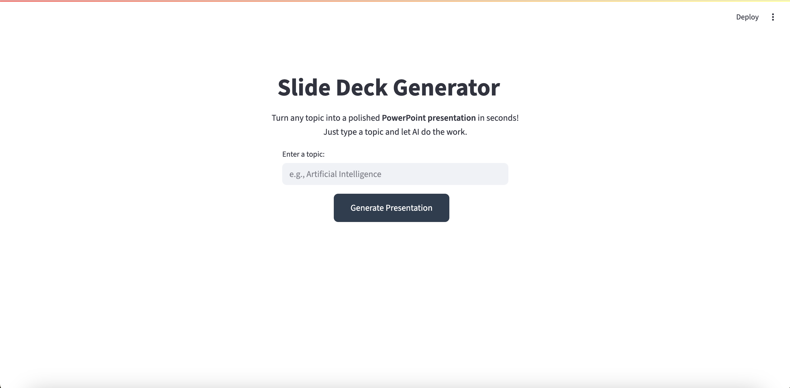

# AI-Powered Slide Deck Generator

An AI-driven application that generates **PowerPoint Slide Deck** automatically from a given topic.  
Currently supports both **Command-Line Interface (CLI)** and a **Streamlit Web Application**, making it flexible for quick use.

---

### Features (Current Implementation)

- **Topic-based slide generation**  
  Provide a topic, and the app generates a slide deck with meaningful titles and bullet points.

- **Dual Interface**  
  - **CLI Mode** – Run directly from terminal with topic input.  
  - **Streamlit Mode** – Simple and interactive web UI.

- **PowerPoint Export**  
  Outputs a `.pptx` file with clean, structured slides.

- **Lightweight & Modular**  
  Clear separation of components for text generation, slide creation, and pipeline integration.

---

### Tech Stack

- **Python 3.9+**
- [Streamlit] – Web interface
- [python-pptx] – Slide creation
- [GEMINI/GROQ-API] – Content generation (can be swapped with other LLMs)

---

### Configure Environment Variables:
    -   Add your secret keys to this file (.env)
        ```
        GEMINI_API_KEY="YOUR_GEMINI_KEY"
        GROQ_API_KEY="YOUR_GROQ_KEY"
        ```

---

### Running the Service

- **Command Line Interface (CLI)**
    The basic version of this project allows you to generate slide decks directly from the command line by providing a topic as input.

    ```bash
    python main.py
    ```

- **Streamlit Web Application**
    This is for more interactive experience.

    ```bash
    streamlit run app.py
    ```

---

### Streamlit Web Interface



---

### Future Scope

This project can be further enhanced by incorporating features like:

- **Custom Slide Aesthetics**
  - Themes, colors, fonts, and corporate branding.

- **User-Controlled Parameters**
  - Number of slides.
  - Amount of content per slide (concise vs detailed).
  - Choice of templates and layouts.

- **Rich Media Integration**
  - Auto-suggested images, icons, and charts relevant to the topic.
  - Integration with image generation models (e.g., DALL·E, Stable Diffusion).

- **Collaboration Features**
  - Export to Google Slides.

- **Enterprise Features**
  - Upload research papers, articles, or reports → get summarized presentations.